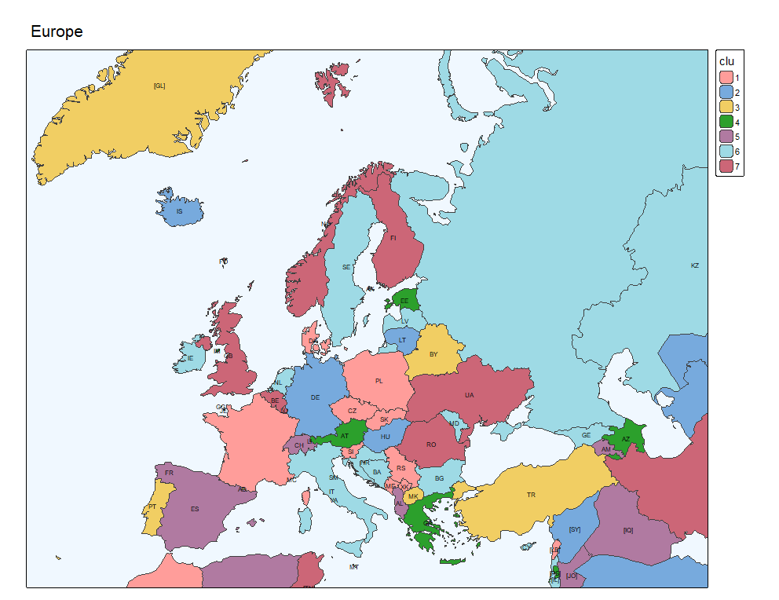

# European science collaboration

December 9, 2025

## Indirect clustering / blockmodeling
```
> Y <- c("1994–2003", "2004–2013", "2014–2023")
> Clab <- c("Balkan", "Eastern", "Post-Soviet", "Scandinavian", 
+   "Western", "Western+small", "Mixed")
> 
> cluA <- list(
+   c("AL", "BA", "HR", "XK", "MK", "ME", "RS", "SI"),
+   c("BG", "CZ", "HU", "RO", "SK", "IM", "LI", "GR"),
+   c("AM", "BY", "GE", "RU", "UA", "MD", "PL", "EE", "LV", "LT"),
+   c("DK", "FO", "FI", "IS", "NO", "SE"),
+   c("FR", "NL", "BE", "IT", "CH", "AT", "ES", "PT", "IE", "GB", "LU"),
+   c("MC", "CY", "MT", "TR", "AZ", "KZ"),
+   c("AD", "SM", "SJ", "AX", "GI", "GG", "JE", "VA", "DE") )
> 
> cluB <- list(
+   c("AL", "BA", "HR", "XK", "MK", "ME", "RS", "SI"),
+   c("BG", "CZ", "HU", "RO", "SK", "EE", "LV", "LT", "TR", "CY", "AX", "MT"),
+   c("AM", "BY", "GE", "RU", "UA", "MD", "PL", "AZ", "KZ"),
+   c("DK", "FO", "FI", "IS", "NO", "SE", "SJ"),
+   c("FR", "NL", "BE", "IT", "CH", "DE", "AT"),
+   c("MC", "GB", "LU", "IE", "LI", "GR", "PT", "ES"),
+   c("AD", "SM", "GG", "JE", "VA", "GI", "IM") )
> 
> cluC <- list(
+   c("AL", "BA", "HR", "XK", "MK", "ME", "RS", "SI"),
+   c("BG", "CZ", "HU", "RO", "SK", "PL", "TR"),
+   c("AM", "BY", "GE", "RU", "UA", "MD", "AZ", "KZ"),
+   c("DK", "FO", "FI", "IS", "NO", "SE", "SJ", "AX", "GI", "IM"),
+   c("FR", "NL", "BE", "IT", "CH", "DE", "ES"),
+   c("MC", "GB", "LU", "IE", "LI", "GR", "PT", "AT", "CY", "GG", "JE", "VA"),
+   c("AD", "SM", "EE", "LV", "LT", "MT") )
> 
> iso2 <- europeC$iso_a2_eh
> which(iso2=="-99")
[1] 73
> iso2[73] <- "CY"
> C <- c(Clab,"Out"); Col <- brewer.pal(n=8,name="Set2"); names(Col) <- C
> lab <- ifelse(iso2 %in% Europe,iso2,paste0("[",iso2,"]"))
>
> EUmap <- function(cluX,tit){
+   clu <- rep(8,n)
+   for(i in 1:7){ for(c in cluX[[i]]) clu[which(c==iso2)] <- i }
+   Clu <- C[clu]
+   ggplot(europeC) + geom_sf() +
+     geom_sf(aes(fill=Clu)) + 
+     scale_fill_manual(values=Col) +
+     geom_sf_text(aes(label=lab),col="firebrick4",size=1.5) +
+     labs(title=tit,x="long",y="lat") +
+     theme_bw()
+ }
> 
> EUmap(cluA,"1994-2003 / indirect")
> EUmap(cluB,"2004-2013 / indirect")
> EUmap(cluC,"2014-2023 / indirect")
```




```

```

```

```


[PDF](./pics/TikZvisPaj.pdf)


<hr />

[Maps](README.md); [Index](../README.md)
