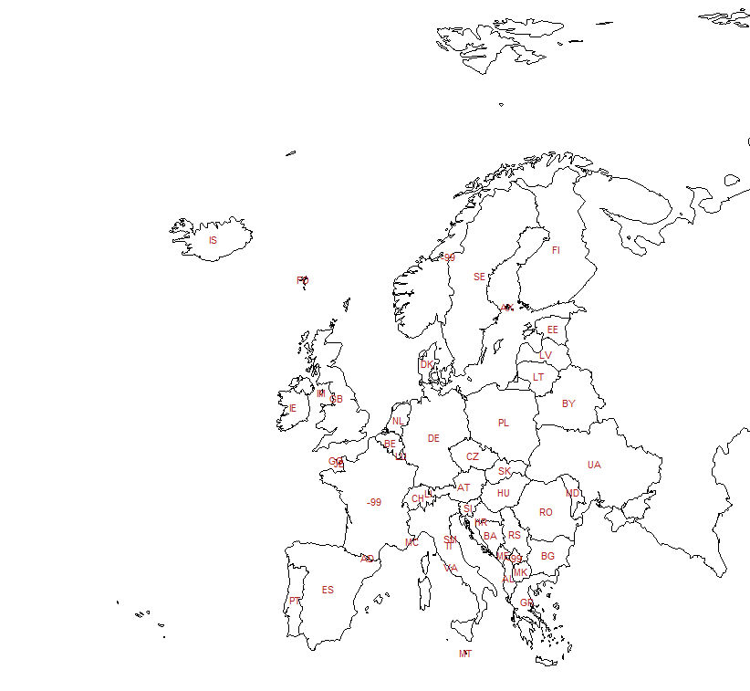

# Labels


## ISO alpha2 and alpha3 codes

```
> ISOf <- "https://github.com/bavla/OpenAlex/raw/refs/heads/main/Countries/maps/ISOcountry.txt"
> iso <- read.csv2(file=ISOf,skip=3,header=TRUE,nrows=251)
> head(iso)
  code           name alpha3
1   AF    Afghanistan    AFG
2   AX  Aland Islands    ALA
3   AL        Albania    ALB
4   DZ        Algeria    DZA
5   AS American Samoa    ASM
6   AD        Andorra    AND
> tail(iso)
    code                name alpha3
246   VI Virgin Islands U.S.    VIR
247   WF   Wallis and Futuna    WLF
248   EH      Western Sahara    ESH
249   YE               Yemen    YEM
250   ZM              Zambia    ZMB
251   ZW            Zimbabwe    ZWE
```
## Improving label placement

```
> europe <- nw[nw$REGION_UN=="Europe", ]
> par(mar=c(0,0,0,0))
> plot(st_geometry(europe),xlim=c(-5,10),ylim=c(35,80),col="steelblue",lwd=0.5)
>
> centroids <- st_centroid(europe,of_largest_polygon=TRUE)
> centers <- cbind(centroids,st_coordinates(centroids))
> par(mar=c(0,0,0,0))
> plot(st_geometry(europe),xlim=c(-5,10),ylim=c(35,80),lwd = 0.5)
> text(centers$X,centers$Y,centers$ISO_A2,cex=.7,col="firebrick")
```



```

```

```

```

```

```

```

```


[PDF](./pics/TikZvisPaj.pdf)

<hr />

[Maps](README.md); [Index](../README.md)
