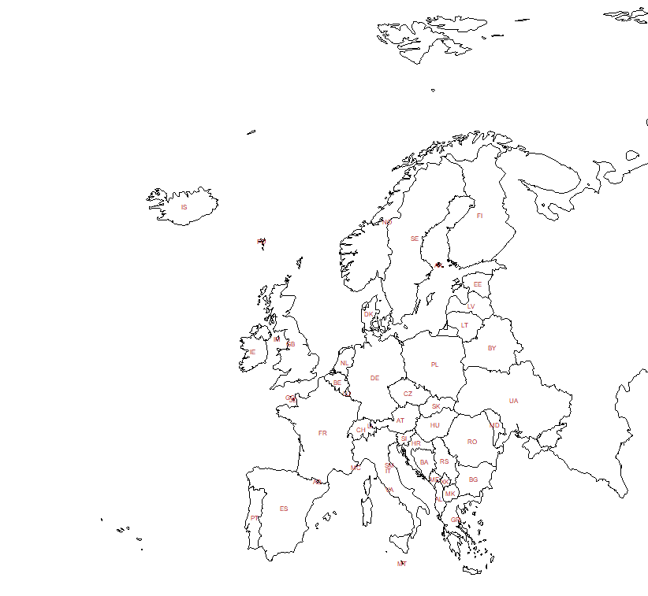

# Labels


## ISO alpha2 and alpha3 codes

```
> ISOf <- "https://github.com/bavla/OpenAlex/raw/refs/heads/main/Countries/maps/ISOcountry.txt"
> iso <- read.csv2(file=ISOf,skip=3,header=TRUE,nrows=251)
> head(iso)
  code           name alpha3
1   AF    Afghanistan    AFG
2   AX  Aland Islands    ALA
3   AL        Albania    ALB
4   DZ        Algeria    DZA
5   AS American Samoa    ASM
6   AD        Andorra    AND
> tail(iso)
    code                name alpha3
246   VI Virgin Islands U.S.    VIR
247   WF   Wallis and Futuna    WLF
248   EH      Western Sahara    ESH
249   YE               Yemen    YEM
250   ZM              Zambia    ZMB
251   ZW            Zimbabwe    ZWE
```
## Improving label placement

The recipe we can find in [The R Graph Gallery](https://r-graph-gallery.com/169-170-basic-manipulation-of-shapefiles.html#centroid)

```
> europe <- nw[nw$REGION_UN=="Europe", ]
> par(mar=c(0,0,0,0))
> plot(st_geometry(europe),xlim=c(-5,10),ylim=c(35,80),col="steelblue",lwd=0.5)
>
> centroids <- st_centroid(europe,of_largest_polygon=TRUE)
> centers <- cbind(centroids,st_coordinates(centroids))
> par(mar=c(0,0,0,0))
> plot(st_geometry(europe),xlim=c(-5,10),ylim=c(35,80),lwd = 0.5)
> text(centers$X,centers$Y,centers$ISO_A2,cex=.7,col="firebrick")
```


There are some problems:
  - some countries (France, Norway, Kosovo), have label **-99**
  - some labels, for example Croatia, have to be moved to a better place

```
> XY <- data.frame(ISO2=centers$ISO_A2,X=centers$X,Y=centers$Y)
> head(XY)
  ISO2         X        Y
1   VA 12.433872 41.90175
2   JE -2.126891 49.21839
3   GG -2.572404 49.46810
4   IM -4.539039 54.22410
5   GB -2.411745 53.82588
6   UA 31.315403 49.19669
> XY[XY$ISO2=="-99",]
   ISO2         X        Y
18  -99 12.158573 63.78631
29  -99 20.872603 42.57020
36  -99  2.460963 46.57229
> centers$ISO_A2[18] <- "NO"; centers$ISO_A2[29] <- "XK"; centers$ISO_A2[36] <- "FR"
> XY[which(XY$ISO2=="HR"),]
   ISO2        X       Y
43   HR 16.41912 45.1568
> centers$X[43] <- 16.54; centers$Y[43] <- 45.75
> par(mar=c(0,0,0,0))
> plot(st_geometry(europe),xlim=c(-5,10),ylim=c(35,80),lwd = 0.5)
> text(centers$X,centers$Y,centers$ISO_A2,cex=.5,col="firebrick")
```



```

```

```

```

```

```


[PDF](./pics/TikZvisPaj.pdf)

<hr />

[Maps](README.md); [Index](../README.md)
