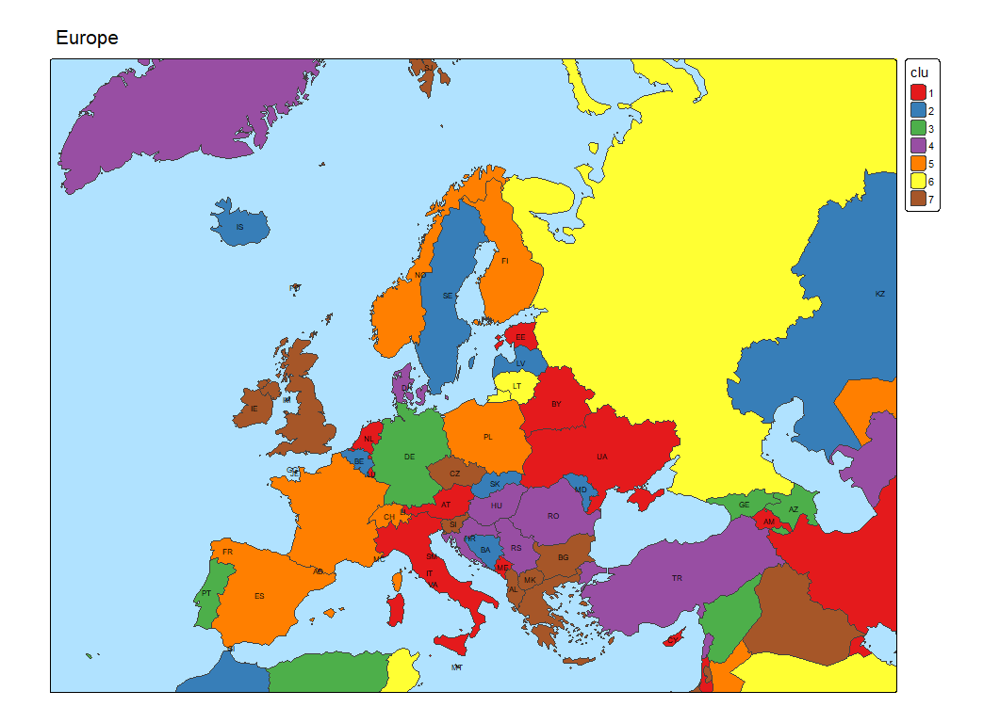
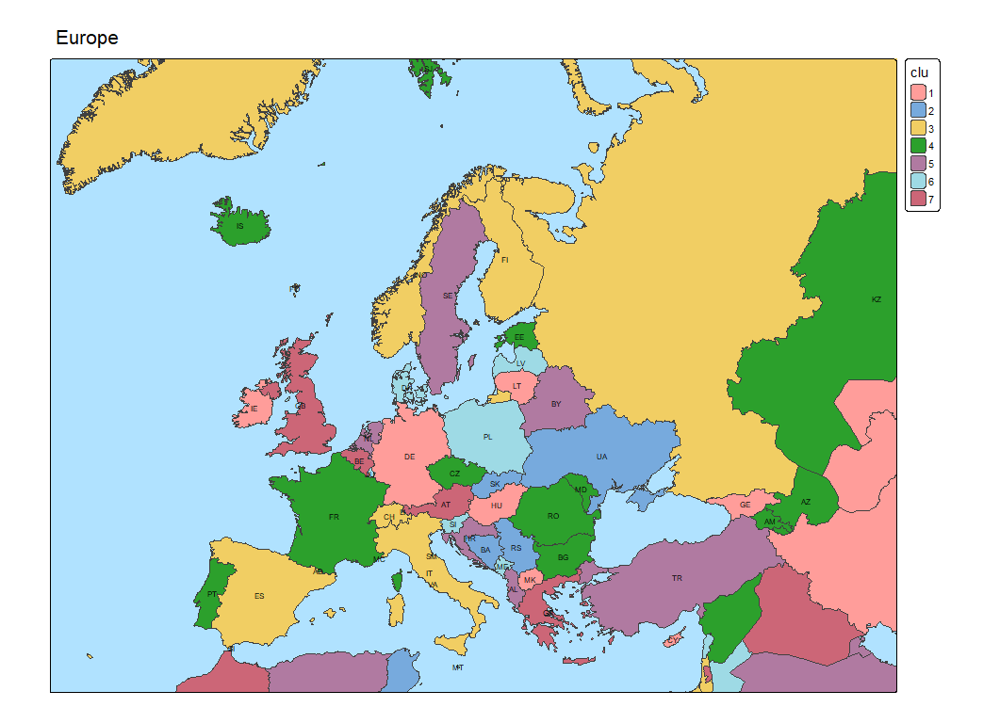

# World countries data 

```
> Europe <- c(
+   "AX", "AL", "AD", "AM", "AT", "AZ", "BY", "BE", "BA", "BG",
+   "HR", "CY", "CZ", "DK", "EE", "FO", "FI", "FR", "GE", "DE",
+   "GI", "GR", "GG", "VA", "HU", "IS", "IE", "IM", "IT", "JE",
+   "KZ", "XK", "LV", "LI", "LT", "LU", "MK", "MT", "MD", "MC",
+   "ME", "NL", "NO", "PL", "PT", "RO", "RU", "SM", "RS", "SK",
+   "SI", "ES", "SJ", "SE", "CH", "TR", "UA", "GB", "OTH")
```

## spData

```
> world = read_sf(system.file("shapes/world.gpkg",package="spData"))
> qtm(world)
> str(world)
sf [177 × 11] (S3: sf/tbl_df/tbl/data.frame)
 $ iso_a2   : chr [1:177] "FJ" "TZ" "EH" "CA" ...
 $ name_long: chr [1:177] "Fiji" "Tanzania" "Western Sahara" "Canada" ...
 $ continent: chr [1:177] "Oceania" "Africa" "Africa" "North America" ...
 $ region_un: chr [1:177] "Oceania" "Africa" "Africa" "Americas" ...
 $ subregion: chr [1:177] "Melanesia" "Eastern Africa" "Northern Africa" "Northern America" ...
 $ type     : chr [1:177] "Sovereign country" "Sovereign country" "Indeterminate" "Sovereign country" ...
 $ area_km2 : num [1:177] 19290 932746 96271 10036043 9510744 ...
 $ pop      : num [1:177] 8.86e+05 5.22e+07 NA 3.55e+07 3.19e+08 ...
 $ lifeExp  : num [1:177] 70 64.2 NA 82 78.8 ...
 $ gdpPercap: num [1:177] 8222 2402 NA 43079 51922 ...
 $ geom     :sfc_MULTIPOLYGON of length 177; first list element: List of 3
  ..$ :List of 1
  .. ..$ : num [1:5, 1:2] -180 -180 -180 -180 -180 ...
  ..$ :List of 1
  .. ..$ : num [1:9, 1:2] 178 178 177 177 178 ...
  ..$ :List of 1
  .. ..$ : num [1:8, 1:2] 180 180 179 179 179 ...
  ..- attr(*, "class")= chr [1:3] "XY" "MULTIPOLYGON" "sfg"
 - attr(*, "sf_column")= chr "geom"
 - attr(*, "agr")= Factor w/ 3 levels "constant","aggregate",..: NA NA NA NA NA NA NA NA NA NA
  ..- attr(*, "names")= chr [1:10] "iso_a2" "name_long" "continent" "region_un" ...
> # st_crs(world) # Coordinate Reference System info
> n <- nrow(world)
> world$clu <- sample(1:6,n,replace=TRUE)
> qtm(world) + tm_crs("auto") + tm_polygons(fill="clu",fill.scale=tm_scale_categorical())
> world$lab <- ifelse(world$iso_a2 %in% Europe,world$iso_a2,paste0("[",world$iso_a2,"]"))
> qtm(world,bbox=c(-20,34,53,77)) + tm_crs("auto") + tm_borders() +
+   tm_polygons(fill="clu",fill.scale=tm_scale_categorical(values="brewer.set1")) +
+   tm_text("lab",size=0.5) + tm_title("Europe") +
+   tm_layout(bg.color="lightblue")
```


Missing countries, nonprecise.

## EU2 / World_Countries

  - [EuroStat/Gisco](https://ec.europa.eu/eurostat/web/gisco/geodata/administrative-units/countries)
  - [Gisco/Countries 2024](https://gisco-services.ec.europa.eu/distribution/v1/countries-2024.html)
  - [ArcGIS](https://services3.arcgis.com/NqGokVvI0NQ6O9Jf/ArcGIS/rest/services/World_Countries/FeatureServer/15)
  - [Gisco/NUTs](https://gisco-services.ec.europa.eu/distribution/v2/nuts/geojson/)

```
> EU <- read_sf("EU2/CNTR_RG_20M_2024_3035.shp")
> tm_shape(EU) + tm_fill() + tm_borders()
> str(EU)
sf [263 × 12] (S3: sf/tbl_df/tbl/data.frame)
 $ CNTR_ID  : chr [1:263] "CD" "CF" "CG" "AD" ...
 $ CNTR_NAME: chr [1:263] "République Démocratique du Congo-Kongo-Kongó-Kongu-Kongo" "République Centrafricaine" ...
 $ NAME_ENGL: chr [1:263] "Democratic Republic of The Congo" "Central African Republic" "Congo" "Andorra" ...
 $ NAME_FREN: chr [1:263] "République démocratique du Congo" "République centrafricaine" "Congo" "Andorre" ...
 $ ISO3_CODE: chr [1:263] "COD" "CAF" "COG" "AND" ...
 $ SVRG_UN  : chr [1:263] "UN Member State" "UN Member State" "UN Member State" "UN Member State" ...
 $ CAPT     : chr [1:263] "Kinshasa" "Bangui" "Brazzaville" "Andorra la Vella" ...
 $ EU_STAT  : chr [1:263] "F" "F" "F" "F" ...
 $ EFTA_STAT: chr [1:263] "F" "F" "F" "F" ...
 $ CC_STAT  : chr [1:263] "F" "F" "F" "F" ...
 $ NAME_GERM: chr [1:263] "Demokratische Republik Kongo" "Zentralafrikanische Republik" "Kongo" "Andorra" ...
 $ geometry :sfc_MULTIPOLYGON of length 263; first list element: List of 1
  ..$ :List of 1
  .. ..$ : num [1:271, 1:2] 6184400 6219916 6260213 6298378 6328634 ...
  ..- attr(*, "class")= chr [1:3] "XY" "MULTIPOLYGON" "sfg"
 - attr(*, "sf_column")= chr "geometry"
 - attr(*, "agr")= Factor w/ 3 levels "constant","aggregate",..: NA NA NA NA NA NA NA NA NA NA ...
  ..- attr(*, "names")= chr [1:11] "CNTR_ID" "CNTR_NAME" "NAME_ENGL" "NAME_FREN" ...
> n <- nrow(EU)
> EU$clu <- sample(1:7,n,replace=TRUE)
> EU$lab <- ifelse(EU$CNTR_ID %in% Europe,EU$CNTR_ID,"")
> EUmap <- tm_shape(EU,bbox=c(-20,35,53,75),crs=3035)
> EUmap + tm_borders() +
+   tm_polygons(fill="clu",fill.scale=tm_scale_categorical(values="brewer.set1")) +
+   tm_text("lab",size=0.5) + tm_title("Europe") +
+   tm_layout(bg.color = "lightskyblue1")
```



## EU5 / World administrative boundaries


```
> wa <- read_sf("EU5/world-administrative-boundaries.shp")
> tm_shape(wa) + tm_fill() + tm_borders()
> str(wa)
sf [256 × 9] (S3: sf/tbl_df/tbl/data.frame)
 $ ISO_3_terri: chr [1:256] "VAT" "MKD" "TUN" "IRQ" ...
 $ Status     : chr [1:256] "Permanent Observer to the UN" "Member State" "Member State" "Member State" ...
 $ ISO_3_count: chr [1:256] "VAT" "MKD" "TUN" "IRQ" ...
 $ English_Nam: chr [1:256] "Holy See" "The former Yugoslav Republic of Macedonia" "Tunisia" "Iraq" ...
 $ Continent_o: chr [1:256] "Europe" "Europe" "Africa" "Asia" ...
 $ Region_of_t: chr [1:256] "Southern Europe" "Southern Europe" "Northern Africa" "Western Asia" ...
 $ ISO_3166_1_: chr [1:256] "VA" "MK" "TN" "IQ" ...
 $ French_Name: chr [1:256] "Saint-Siège" "Macédoine du Nord" "Tunisie" "Iraq" ...
 $ geometry   :sfc_MULTIPOLYGON of length 256; first list element: List of 1
  ..$ :List of 1
  .. ..$ : num [1:8, 1:2] 12.4 12.4 12.5 12.5 12.5 ...
  ..- attr(*, "class")= chr [1:3] "XY" "MULTIPOLYGON" "sfg"
 - attr(*, "sf_column")= chr "geometry"
 - attr(*, "agr")= Factor w/ 3 levels "constant","aggregate",..: NA NA NA NA NA NA NA NA
  ..- attr(*, "names")= chr [1:8] "ISO_3_terri" "Status" "ISO_3_count" "English_Nam" ...
> n <- nrow(wa)
> wa$clu <- sample(1:7,n,replace=TRUE)
> qtm(wa) + tm_polygons(fill = "clu",fill.scale = tm_scale_categorical())
> wa$lab <- ifelse(wa$ISO_3166_1_ %in% Europe,wa$ISO_3166_1_,"")
> EUmap <- tm_shape(wa,bbox=c(-20,35,53,75),crs=3035)
> EUmap + tm_borders() +
+   tm_polygons(fill="clu",fill.scale=tm_scale_categorical()) +
+   tm_text("lab",size=0.5) + tm_title("Europe") +
+   tm_layout(bg.color="lightskyblue1")
```


## EU6 /

```

```

```

```

```

```


[PDF](./pics/TikZvisPaj.pdf)

<hr />

[Index](README.md)
