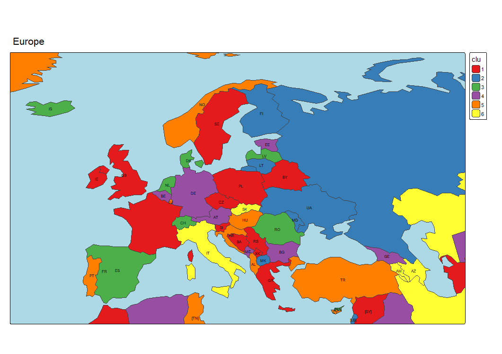

# World countries data 

```
> Europe <- c(
+   "AX", "AL", "AD", "AM", "AT", "AZ", "BY", "BE", "BA", "BG",
+   "HR", "CY", "CZ", "DK", "EE", "FO", "FI", "FR", "GE", "DE",
+   "GI", "GR", "GG", "VA", "HU", "IS", "IE", "IM", "IT", "JE",
+   "KZ", "XK", "LV", "LI", "LT", "LU", "MK", "MT", "MD", "MC",
+   "ME", "NL", "NO", "PL", "PT", "RO", "RU", "SM", "RS", "SK",
+   "SI", "ES", "SJ", "SE", "CH", "TR", "UA", "GB", "OTH")
```

## spData

```
> world = read_sf(system.file("shapes/world.gpkg", package = "spData"))
> qtm(world)
> str(world)
sf [177 × 11] (S3: sf/tbl_df/tbl/data.frame)
 $ iso_a2   : chr [1:177] "FJ" "TZ" "EH" "CA" ...
 $ name_long: chr [1:177] "Fiji" "Tanzania" "Western Sahara" "Canada" ...
 $ continent: chr [1:177] "Oceania" "Africa" "Africa" "North America" ...
 $ region_un: chr [1:177] "Oceania" "Africa" "Africa" "Americas" ...
 $ subregion: chr [1:177] "Melanesia" "Eastern Africa" "Northern Africa" "Northern America" ...
 $ type     : chr [1:177] "Sovereign country" "Sovereign country" "Indeterminate" "Sovereign country" ...
 $ area_km2 : num [1:177] 19290 932746 96271 10036043 9510744 ...
 $ pop      : num [1:177] 8.86e+05 5.22e+07 NA 3.55e+07 3.19e+08 ...
 $ lifeExp  : num [1:177] 70 64.2 NA 82 78.8 ...
 $ gdpPercap: num [1:177] 8222 2402 NA 43079 51922 ...
 $ geom     :sfc_MULTIPOLYGON of length 177; first list element: List of 3
  ..$ :List of 1
  .. ..$ : num [1:5, 1:2] -180 -180 -180 -180 -180 ...
  ..$ :List of 1
  .. ..$ : num [1:9, 1:2] 178 178 177 177 178 ...
  ..$ :List of 1
  .. ..$ : num [1:8, 1:2] 180 180 179 179 179 ...
  ..- attr(*, "class")= chr [1:3] "XY" "MULTIPOLYGON" "sfg"
 - attr(*, "sf_column")= chr "geom"
 - attr(*, "agr")= Factor w/ 3 levels "constant","aggregate",..: NA NA NA NA NA NA NA NA NA NA
  ..- attr(*, "names")= chr [1:10] "iso_a2" "name_long" "continent" "region_un" ...
> # st_crs(world) # Coordinate Reference System info
> n <- nrow(world)
> world$clu <- sample(1:6,n,replace=TRUE)
> qtm(world) + tm_crs("auto") + tm_polygons(fill = "clu",fill.scale = tm_scale_categorical())
> world$lab <- ifelse(world$iso_a2 %in% Europe,world$iso_a2,paste0("[",world$iso_a2,"]"))
> qtm(world,bbox=c(-20,34,53,77)) + tm_crs("auto") + tm_borders() +
+   tm_polygons(fill="clu",fill.scale=tm_scale_categorical(values="brewer.set1")) +
+   tm_text("lab",size = 0.5) + tm_title("Europe") +
+   tm_layout(bg.color = "lightblue")
> 

```



```

```

```

```

```

```

```

```

```

```


[PDF](./pics/TikZvisPaj.pdf)

<hr />

[Index](README.md)
